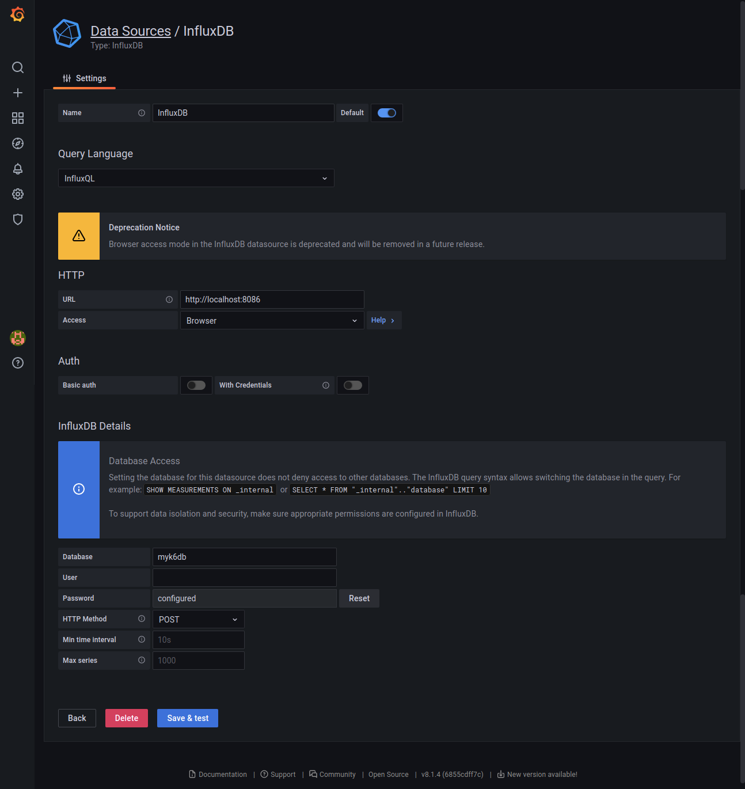

# K6 Load Test Example 

This repository demonstrates an example of k6 Load tester which implements Smoke, Load, Stress and Soak tests scenarios on an [AUT](https://github.com/testdrivenio/flask-vue-crud)(Application Under Test). Additionally it stores the results in Influxdb an could be visualized in Grafana.

## Prerequisites

- npm
- python 3.6+
- Docker

## Installation

### Application under test

The AUT example is https://github.com/testdrivenio/flask-vue-crud which uses a flask application as server and vueJs as client. Clone, install and setup the requirements just as the [readme](https://github.com/testdrivenio/flask-vue-crud/blob/master/README.md) guideline. You should be able to see the app on http://localhost:8080.

### Install k6

Follow the instructions provided in https://k6.io/docs/getting-started/installation/ or for Ubuntu distributions:

```shell
sudo apt-get update && sudo apt-get install ca-certificates gnupg2 -y
```

```shell
$ sudo apt-key adv --keyserver hkp://keyserver.ubuntu.com:80 --recv-keys C5AD17C747E3415A3642D57D77C6C491D6AC1D69
$ echo "deb https://dl.k6.io/deb stable main" | sudo tee /etc/apt/sources.list.d/k6.list
$ sudo apt-get update
$ sudo apt-get install k6
```

### Setup Influx and Grafana

1. Up the `docker-compose.yaml` file with:

```shell
docker-compose -d up
```

You should be able to see Grafana dashboard on http://localhost:3000

Its default username and password is: `admin`

2.  Create a data source with below configurations:



2.  Import the pre-configured Exa dashboard by id: `15080` or by the [link](https://grafana.com/grafana/dashboards/15080)

Now everything is ready to get the test.

## Run the test

1. Clone the repository

2. change directory to files:

```shell
cd files
```

Run k6 with the desired test mode. Wait for the test to get accomplished.

```shell
k6 run -e test_mode=smoke --out influxdb=http://localhost:8086/myk6db test.js
```

You can choose the *test_mode* value according to the below options.

- **smoke**: Targets the functionality of the system under the lowest load: Is it working with only one user?

- **load**: Targets the system under normal usage by the users. You should ask: How many users are using the system simultaneously typically and how long is their session?

- **stress**: What is the maximum capacity of the system? How many users with what kind of behavior should use the site to disrate its quality due to the SLO: i.e. availability, request latency, throughput and etc.

- **soak**: Would the system last for a long time(normally hours to days) under normal conditions? It’s working for 15min under normal condition in the load test but is feasible for a much longer time?

3. Now you can get back to the imported [grafana dashboard](http://localhost:3000) and see the results.


## Running k6 with Docker

You can use the k6 official docker image to run the tests. This is a practical approach specially for CI/CD purposes like run the tests with cronjob. The Dockerfile in the root of the repository will do that for you. Furthermore, you can use it in docker-compose along with other containers by commenting out the *k6-tester* service.

